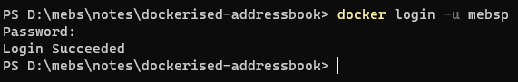
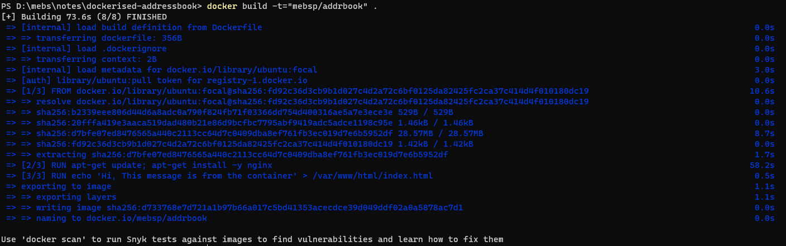
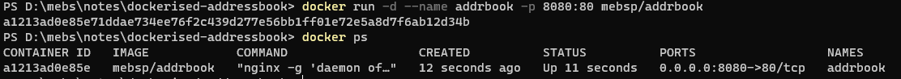
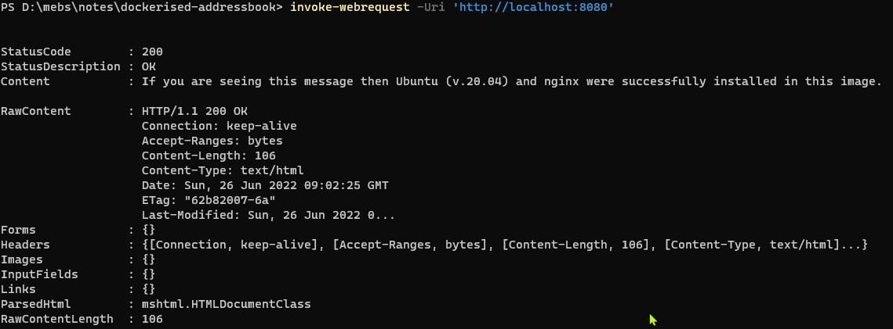
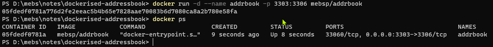
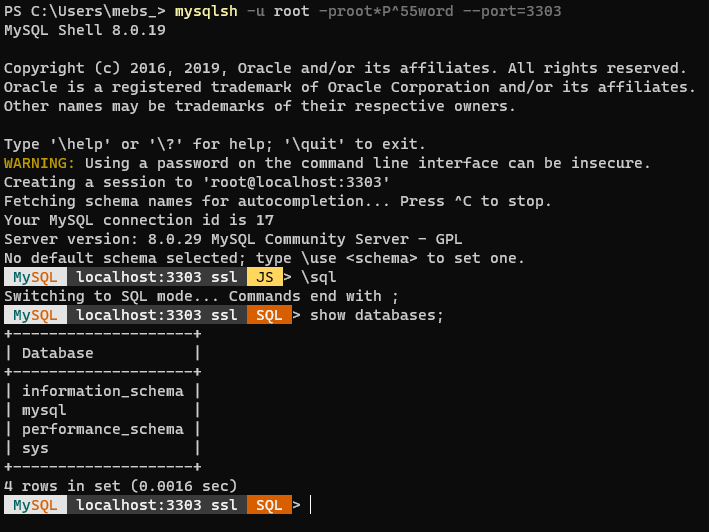

##### Login to Docker-Hub

`docker login -u mebsp`



##### Building a test Dockerfile with nginx

***Create the Dockerfile***
```dockerfile
########## Dockerfile contents ##########
FROM ubuntu:focal
LABEL maintainer="zonesoft" \
      email="mp30028@gmail.com" \
      description="Dockerfile used for learning purposes"
RUN apt-get update; apt-get install -y nginx
RUN echo 'If you are seeing this message then Ubuntu (v.20.04) and nginx were successfully installed in this image.' > /var/www/html/index.html
EXPOSE 80
CMD ["nginx", "-g", "daemon off;"]
```

***Run the build command***
`docker build -t="mebsp/addrbook" .`


***Run the container***
`docker run -d --name addrbook -p 8080:80 mebsp/addrbook`


***Check it's running ok***
`invoke-webrequest -Uri 'http://localhost:8080'`



##### Building a Dockerfile starting with a MySql official image

 ***Clean up previous addrbook containers and images***
`docker stop addrbook`
`docker rm addrbook`
`docker images`
`docker rmi mebsp/addrbook`


***Create the Dockerfile***
```dockerfile
########## Dockerfile contents ##########
FROM mysql:8.0.29
LABEL maintainer="zonesoft" \
      email="mp30028@gmail.com" \
      description="Dockerfile used for learning purposes"
ENV MYSQL_ROOT_PASSWORD root*P^55word
EXPOSE 3306
```

***Login to Docker-Hub***
`docker login -u mebsp`

***Run the build command***
`docker build --no-cache -t="mebsp/addrbook" .`

***Run the container***
`docker run -d --name addrbook -p 3303:3306 mebsp/addrbook`


***Connect to MySql with MySql-shell***
`mysqlsh -u root -proot*P^55word --port=3303`

At the mysqlsh prompt  switch to sql mode with `\sql` command



